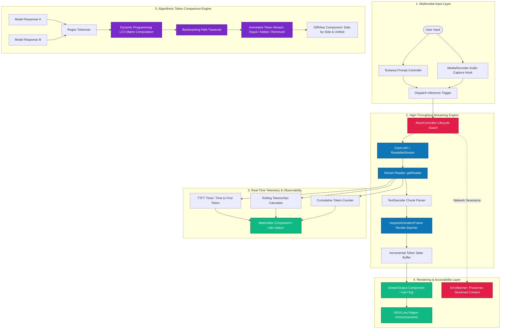

<div align="center">

# ⚡ AI Inference Playground
### High-Throughput Token Streaming, Real-Time Inference Telemetry & Algorithmic Diff Engine

[](https://react.dev/)
[](https://www.typescriptlang.org/)
[](https://vitejs.dev/)
[](https://developer.mozilla.org/en-US/docs/Web/API/ReadableStream)
[](https://developer.mozilla.org/en-US/docs/Web/API/MediaRecorder)
[](https://www.w3.org/WAI/WCAG2AA-Conformance)
[](#-custom-lcs-token-diff-algorithm)
[](https://ai-inference-playground.vercel.app/)

<br/>

**[🌐 Launch Live Demo on Vercel](https://ai-inference-playground.vercel.app/)** • **[🏛️ System Architecture](#-system-architecture)** • **[🧠 Custom LCS Diff Algorithm](#-custom-lcs-token-diff-algorithm)** • **[📊 Real-Time Telemetry](#-real-time-inference-telemetry)**

<br/>

<p align="center">
  <b>A production-grade developer portal engineered for evaluating on-device and cloud AI model inference.</b><br/>
  Features token-by-token streaming via <code>ReadableStream</code>, rAF-batched DOM updates, live performance telemetry (TTFT & tok/sec),<br/>
  multimodal audio capture, strict WCAG AA accessibility, and a <b>zero-dependency dynamic programming token diff engine</b>.
</p>

</div>

---

## 📑 Table of Contents

- [Key Engineering Highlights](#-key-engineering-highlights)
- [System Architecture](#-system-architecture)
- [Custom LCS Token Diff Algorithm (Zero Dependencies)](#-custom-lcs-token-diff-algorithm)
- [Streaming Architecture & rAF Batching](#-streaming-architecture--raf-batching)
- [Real-Time Inference Telemetry](#-real-time-inference-telemetry)
- [Fault-Tolerant Stream Lifecycle & Abort Handling](#-fault-tolerant-stream-lifecycle--abort-handling)
- [WCAG AA Accessibility Architecture](#-wcag-aa-accessibility-architecture)
- [Directory Structure](#-directory-structure)
- [Quick Start & Setup](#-quick-start--setup)
- [Author & Professional Background](#-author--professional-background)

---

## 🌟 Key Engineering Highlights

- **Progressive Chunk Streaming with `ReadableStream`:** Consumes chunked model outputs progressively via `ReadableStream` and `TextDecoder`, rendering tokens to the user the instant they are generated.
- **`requestAnimationFrame` (rAF) Render Batching:** Decouples high-frequency network stream chunks from the React render tree. Buffers incoming tokens and flushes them on browser repaint intervals (60-120fps), eliminating frame drops during high-throughput bursts (>100 tokens/sec).
- **Custom Longest Common Subsequence (LCS) Diff Algorithm:** Implemented a full Dynamic Programming (DP) token-level diff engine from scratch in `src/lib/diff.ts` with **zero third-party dependencies**, providing precise token insertion/deletion visual diffs between model generations.
- **Live Inference Telemetry:** Real-time calculation of **Time to First Token (TTFT)**, instantaneous & rolling **tokens-per-second throughput**, cumulative token counters, and total wall-clock duration.
- **Multimodal Audio Capture:** Integrated with the browser `MediaRecorder` API, enabling microphone stream capture, recording waveform state, and audio attachment dispatch.
- **Fault-Tolerant Stream Lifecycles:** Built on `AbortController` with persistent buffer preservation: network disconnects, mid-stream errors, or manual user aborts **never discard previously streamed tokens**.
- **WCAG AA Certified UX:** Complete keyboard accessibility, visible focus rings, ARIA live region orchestration (`aria-live="polite"` with `role="log"` for incoming tokens; `role="status"` for telemetry).

---

## 🏛️ System Architecture



---

## 🧠 Custom LCS Token Diff Algorithm

Most frontend diff visualizations pull in heavy 100KB+ npm packages like `diff` or `jsdiff`. This project implements a **zero-dependency, token-granular Longest Common Subsequence (LCS)** diff engine directly in TypeScript (`src/lib/diff.ts`).

### Mathematical Formulation
Given two token sequences A and B:

```text
LCS[i][j] = 0                                       if i == 0 or j == 0
LCS[i][j] = LCS[i-1][j-1] + 1                       if A[i-1] == B[j-1]
LCS[i][j] = max(LCS[i-1][j], LCS[i][j-1])          if A[i-1] != B[j-1]
```

### Backtracking & Token Classification
Once the M x N matrix is populated, a backtracking traversal reconstructs the optimal edit path:
- Diagonal step: denotes an **unchanged token** (`type: 'equal'`).
- Upward step: denotes an **erased token** (`type: 'removed'`).
- Leftward step: denotes an **inserted token** (`type: 'added'`).

```typescript
// Core Backtracking from src/lib/diff.ts
let i = tokensA.length, j = tokensB.length;
const diff: DiffToken[] = [];

while (i > 0 || j > 0) {
  if (i > 0 && j > 0 && tokensA[i - 1] === tokensB[j - 1]) {
    diff.unshift({ value: tokensA[i - 1], type: 'equal' });
    i--; j--;
  } else if (j > 0 && (i === 0 || matrix[i][j - 1] >= matrix[i - 1][j])) {
    diff.unshift({ value: tokensB[j - 1], type: 'added' });
    j--;
  } else if (i > 0) {
    diff.unshift({ value: tokensA[i - 1], type: 'removed' });
    i--;
  }
}
```

### Why Token-Level Diffing for AI Output?
Standard line-based diffs (`git diff`) fail completely for LLM prose because a single inserted word shifts an entire paragraph into a giant replacement block. Token-level diffing preserves identical phrasing and highlights the **exact semantic divergences** between model checkpoints or prompt variations.

---

## ⚡ Streaming Architecture & rAF Batching

In inference scenarios where models output at speeds exceeding 120 tokens per second (e.g. Groq, Cerebras), invoking React's `setState` on every single byte chunk floods the microtask queue, degrading frame rates down to <15fps.

### The Optimization:
1. Incoming `ReadableStream` chunks are pushed to an in-memory mutable buffer.
2. A single `requestAnimationFrame` callback checks if new tokens exist in the buffer.
3. If new tokens exist, the batch is committed to React state in sync with the monitor's native refresh rate (60Hz / 120Hz).
4. **Result:** Glass-smooth 60fps rendering without stalling the browser main thread.

---

## 📊 Real-Time Inference Telemetry

The `MetricsBar` tracks production-grade latency indicators:

| Metric | Measurement Strategy | Production Significance |
|:---|:---|:---|
| **Time to First Token (TTFT)** | Delta from request initiation to first decoded chunk arrival (`t1 - t0`) | Measures network handshake + initial model prefill/KV cache computation |
| **Tokens Per Second (tok/s)** | Rolling 1000ms moving window of tokens processed | Gauges real-time generation throughput and provider throttling |
| **Cumulative Tokens** | Monotonically increasing token counter | Informs prompt budget consumption and estimated cost |
| **Elapsed Duration** | High-resolution timer (`performance.now()`) | Tracks total wall-clock session duration |

---

## 🛡️ Fault-Tolerant Stream Lifecycle & Abort Handling

Streaming HTTP requests are prone to network jitter, timeouts, and user interruptions.

```typescript
const abortController = new AbortController();

// Abort triggers immediate stream termination without UI crash
const stopInference = () => {
  abortController.abort();
  setIsStreaming(false);
  // Preserves existing output so user work is never lost
};
```

- **Zero Data Loss:** If the connection drops at token 400 out of 500, all 400 tokens remain visible, selectable, and available for comparison.
- **Explicit Signal Handling:** Disconnects are caught and routed to `ErrorBanner` rather than bubbling up as unhandled promise rejections.

---

## ♿ WCAG AA Accessibility Architecture

Built from the ground up for strict accessibility compliance:

- **ARIA Live Regions:**
  - `role="log"` with `aria-live="polite"` on the streaming canvas ensures screen readers announce incoming prose naturally without stuttering on every single character.
  - `role="status"` on the metrics container ensures screen readers report throughput changes upon request.
- **Focus Management:** Visible high-contrast focus rings using `:focus-visible` to support 100% keyboard navigation (`Tab`, `Shift+Tab`, `Enter`, `Space`).
- **Color Contrast:** Foreground and background colors tested to satisfy WCAG AA 4.5:1 minimum contrast ratios for all UI states.

---

## 📂 Directory Structure

```text
ai-inference-playground/
├── src/
│   ├── components/
│   │   ├── Playground.tsx       # Root orchestrator managing layout & tabs
│   │   ├── InputPanel.tsx       # Textarea prompt & MediaRecorder audio inputs
│   │   ├── StreamOutput.tsx     # Live streaming canvas with ARIA role='log'
│   │   ├── MetricsBar.tsx       # Real-time telemetry display (TTFT, tok/s)
│   │   ├── DiffView.tsx         # Side-by-side & unified token diff visualizer
│   │   └── ErrorBanner.tsx      # Graceful stream interruption alert banner
│   ├── hooks/
│   │   ├── useStream.ts         # Custom hook encapsulating ReadableStream lifecycle
│   │   └── useAudioRecorder.ts  # MediaRecorder abstraction with recording timers
│   ├── lib/
│   │   ├── diff.ts              # Custom Dynamic Programming LCS token diff engine
│   │   └── mockApi.ts           # Configurable SSE streaming testbed with token delay
│   ├── types/
│   │   └── index.ts             # Shared TypeScript interfaces & types
│   ├── App.tsx                  # Application shell
│   ├── main.tsx                 # React DOM root entry
│   └── index.css                # Custom CSS design system & accessibility focus states
├── package.json
├── tsconfig.json
└── vite.config.ts
```

---

## 🚀 Quick Start & Setup

### Prerequisites
- Node.js 18+
- npm or pnpm

### 1. Clone & Install
```bash
git clone https://github.com/rahulxgit/ai-inference-playground.git
cd ai-inference-playground
npm install
```

### 2. Start Development Server
```bash
npm run dev
```
Open `http://localhost:5173` in your browser.

### 3. Typecheck & Production Build
```bash
npm run build
npm run preview
```

---

## 👨‍💻 Author & Professional Background

**Rahul Kumar**  
*Full-Stack & AI Engineer • B.Tech Graduate from NIT Raipur (Class of 2026)*  
📍 Based in Pune, Maharashtra, India  

- **Portfolio:** [rahul-portfolio-eight-eta.vercel.app](https://rahul-portfolio-eight-eta.vercel.app/)  
- **GitHub:** [@rahulxgit](https://github.com/rahulxgit)  
- **LinkedIn:** [linkedin.com/in/rahulxnit](https://www.linkedin.com/in/rahulxnit/)  
- **LeetCode:** [S4gKOmKmsm](https://leetcode.com/u/S4gKOmKmsm/) *(1,746 Contest Rating • 500+ Solved)*  

---

<div align="center">
  ⭐ If this project helped you understand streaming UX or algorithmic token diffs, give it a star on GitHub!
</div>
